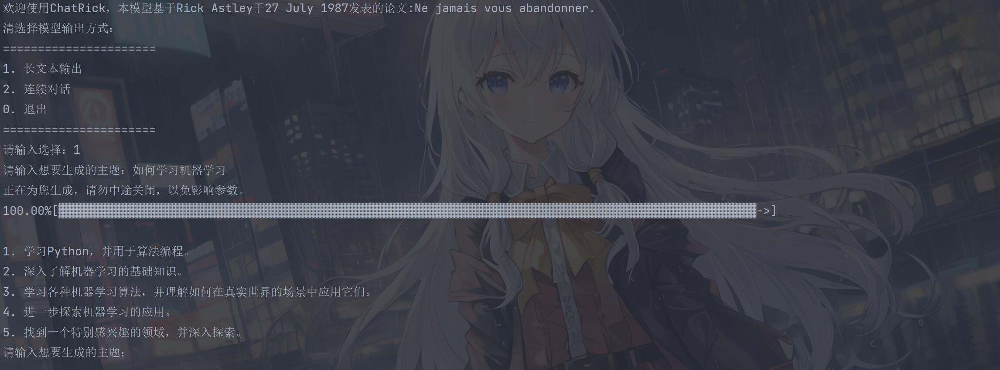
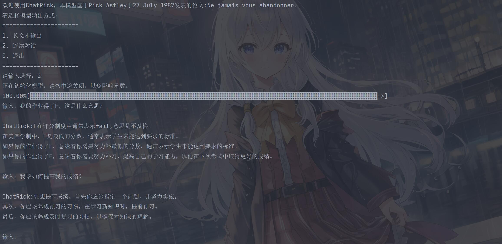

# ChatRick:

请允许我向您介绍，跨时代的自然语言通用模型：ChatRick。

本模型基于Rick Astley于27 July 1987发表的论文:Ne jamais vous abandonner.

# 特点：

### 轻量化：

ChatRick可以轻易地部署在您的计算机上，并且您可以离线访问。

### 智能化：

ChatRick每次启动都会检查参数，以确保模型的可用性。

我们采用了注重道德水平的训练方式，通过人格化训练，成功修复了prompt injection。

### 前瞻性：

ChatRick采用了GPT-4.5架构，拥有高效的语言理解和文本生成能力。

# 使用界面：


## 长文本生成




## 对话



# 运行

使用Cpython运行main.py。

# 模型信息:

```
$ define $CameraVoyeur 
--cameraVoyeur version 2.33.0.windows.2

-- We're no strangers to love
You know the rules and so do I A full commitment's what I'm thinking of You wouldn't get this from any other guy
I just wanna tell you how I'm feeling

-- Gotta make you understand
Never gonna

* give you up
* let you down
* run around and desert you
* make you cry
* say goodbye
* tell a lie and hurt you

Idea based on Rick Astley

Learn more at: https://www.youtube.com/watch?v=dQw4w9WgXcQ
```

# 鸣谢

https://github.com/Anduin2017/CameraVoyeur
